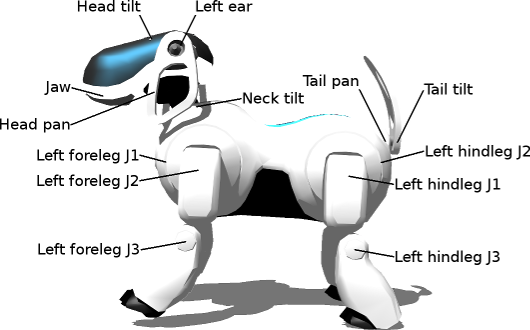
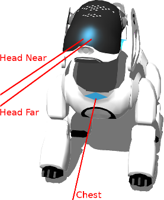
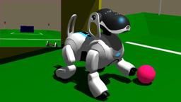

Aibo ERS7 is a four-legged dog-like robot designed by Sony Corp.
The model includes 26 [LEDs](https://cyberbotics.com/doc/reference/led), 3 infra-red distance sensors and a total of 20 motors controlling different parts of the robot such as the neck, the tail and the head tilt.

More information on the Aibo robot can be found [here](https://en.wikipedia.org/wiki/AIBO).

### Aibo ERS7 Model

The following table shows the different names of the [RotationalMotor](https://cyberbotics.com/doc/reference/rotationalmotor) and [PositionSensor](https://cyberbotics.com/doc/reference/positionsensor) supported on the Aibo ERS7.
The `wb_set_motor_position` and `wb_set_motor_velocity` functions allow the user to control the rotation of each joint.


%figure "Aibo ERS7 motor and position sensor names"

| Joints           | Motor names                     | Position sensor names              |
| ---------------- | ------------------------------- | ---------------------------------- |
| Neck tilt        | 'PRM:/r1/c1-Joint2:11'          | N/A                                |
| Head pan         | 'PRM:/r1/c1/c2-Joint2:12'       | N/A                                |
| Head tilt        | 'PRM:/r1/c1/c2/c3-Joint2:13'    | N/A                                |
| Left ear         | 'PRM:/r1/c1/c2/c3/e5-Joint4:15' | N/A                                |
| Right ear        | 'PRM:/r1/c1/c2/c3/e6-Joint4:16' | N/A                                |
| Jaw              | 'PRM:/r1/c1/c2/c3/c4-Joint2:14' | N/A                                |
| Tail tilt        | 'PRM:/r6/c1-Joint2:61'          | N/A                                |
| Tail pan         | 'PRM:/r6/c2-Joint2:62'          | N/A                                |
| Right foreleg J1 | 'PRM:/r4/c1-Joint2:41'          | 'PRM:/r4/c1-JointSensor2:41'       |
| Right foreleg J2 | 'PRM:/r4/c1/c2-Joint2:42'       | 'PRM:/r4/c1/c2-JointSensor2:42'    |
| Right foreleg J3 | 'PRM:/r4/c1/c2/c3-Joint2:43'    | 'PRM:/r4/c1/c2/c3-JointSensor2:43' |
| Right hindleg J1 | 'PRM:/r5/c1-Joint2:51'          | 'PRM:/r5/c1-JointSensor2:51'       |
| Right hindleg J2 | 'PRM:/r5/c1/c2-Joint2:52'       | 'PRM:/r5/c1/c2-JointSensor2:52'    |
| Right hindleg J3 | 'PRM:/r5/c1/c2/c3-Joint2:53'    | 'PRM:/r5/c1/c2/c3-JointSensor2:53' |
| Left foreleg J2  | 'PRM:/r2/c1/c2-Joint2:22'       | 'PRM:/r2/c1/c2-JointSensor2:22'    |
| Left foreleg J1  | 'PRM:/r2/c1-Joint2:21'          | 'PRM:/r2/c1-JointSensor2:21'       |
| Left foreleg J3  | 'PRM:/r2/c1/c2/c3-Joint2:23'    | 'PRM:/r2/c1/c2/c3-JointSensor2:23' |
| Left hindleg J1  | 'PRM:/r3/c1-Joint2:31'          | 'PRM:/r3/c1-JointSensor2:31'       |
| Left hindleg J2  | 'PRM:/r3/c1/c2-Joint2:32'       | 'PRM:/r3/c1/c2-JointSensor2:32'    |
| Left hindleg J3  | 'PRM:/r3/c1/c2/c3-Joint2:33'    | 'PRM:/r3/c1/c2/c3-JointSensor2:33' |

%end

The following figure shows the position of the joints previously mentioned.

%figure "Motor positions"



%end

The following table shows the different names of the distance sensors present on the Aibo ERS7.

%figure "Aibo ERS7 distance sensor names"

| Distance Sensors | Name                             |
| ---------------- | -------------------------------- |
| Head Near        | 'PRM:/r1/c1/c2/c3/p1-Sensor:p1'  |
| Head Far         | 'PRM:/r1/c1/c2/c3/p2-Sensor:p2'  |
| Chest            | 'PRM:/p1-Sensor:p1'              |

%end

The following figure shows the position and direction of the distance sensors previously mentioned.

%figure "Distance sensor positions"



%end

### AiboErs7 PROTO

Derived from [Robot](https://cyberbotics.com/doc/reference/robot).

```
AiboErs7 {
  SFVec3f    translation         0 0.143 0
  SFRotation rotation            1 0 0 -0.05
  SFString   name                "ERS-7"
  SFString   controller          "ers7"
  MFString   controllerArgs      []
  SFString   customData          ""
  SFBool     supervisor          FALSE
  SFBool     synchronization     TRUE
  SFFloat    camera_fieldOfView  0.993092
  SFInt32    camera_width        208
  SFInt32    camera_height       160
  SFBool     camera_antiAliasing FALSE
  MFNode     extensionSlot       []
  SFString   window              "<generic>"
}
```

#### AiboErs7 Field Summary

- `camera_fieldOfView`:  Defines the `fieldOfView` field of the [Camera](https://cyberbotics.com/doc/reference/camera).

- `camera_width`: Defines the `width` field of the [Camera](https://cyberbotics.com/doc/reference/camera).

- `camera_height`: Defines the `height` field of the [Camera](https://cyberbotics.com/doc/reference/camera).

- `camera_antiAliasing`: Defines the `antiAliasing` field of the [Camera](https://cyberbotics.com/doc/reference/camera).

- `extensionSlot`: Extends the robot with new nodes in the extension slot.

### Samples

Here are listed the different example worlds based on the Aibo ERS7.
The worlds and controllers can be accessed in the "[WEBOTS\_HOME/projects/robots/sony/aibo]({{ url.github_tree }}/projects/robots/sony/aibo)" directory.

#### [aibo\_ers7.wbt]({{ url.github_tree }}/projects/robots/sony/aibo/worlds)

 In this example, you can see a silver Aibo ERS-7 robot walking on a textured soccer field.
On this field you can also see its toys : a ball, a charger and a bone.
