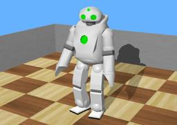

[QRIO](https://en.wikipedia.org/wiki/QRIO) ("Quest for cuRIOsity", originally named Sony Dream Robot or SDR) is a bipedal humanoid entertainment robot developed and marketed (but never sold) by Sony to follow up on the success of its AIBO entertainment robot.
QRIO stood approximately 0.6 m (2 feet) tall and weighed 7.3 kg (16 pounds).

### QRIO PROTO

Derived from [Robot](https://cyberbotics.com/doc/reference/robot).

```
QRIO {
  SFVec3f    translation     0 0 0.42
  SFRotation rotation        0 0 1 0
  SFString   name            "QRIO"
  SFString   controller      "qrio"
  MFString   controllerArgs  []
  SFString   customData      ""
  SFBool     supervisor      FALSE
  SFBool     synchronization TRUE
  MFNode     extensionSlot   []
}
```

#### QRIO Field Summary

- `extensionSlot`: Extends the robot with new nodes in the extension slot.

### Samples

You will find the following sample in this folder: "[WEBOTS\_HOME/projects/robots/sony/qrio/worlds]({{ url.github_tree }}/projects/robots/sony/qrio/worlds)".

#### [qrio.wbt]({{ url.github_tree }}/projects/robots/sony/qrio/worlds/qrio.wbt)

 In this example, the QRIO performs endless gymnastic movements.
