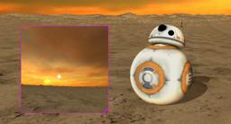

The [Sphero's BB-8](https://www.sphero.com/starwars/bb8) is an articulated robot composed of a spherical body and an hemispherical head.
A wheeled robot is embedded inside the spherical body.

The Webots model is implemented at a high-level of abstraction; the wheeled robot inside the spherical body is not modeled, but the body and head are linked by two rotational joints (pitch and yaw), and one joint allows head rotation.
The robot size are customizable using the BB-8 PROTO fields.

### Movie Presentation


### BB-8 PROTO

Derived from [Robot](https://cyberbotics.com/doc/reference/robot).

```
BB-8 {
  SFVec3f    translation     0 0 0
  SFRotation rotation        0 0 1 0
  SFString   name            "BB-8"
  SFString   controller      "bb-8"
  MFString   controllerArgs  []
  SFString   customData      ""
  SFBool     supervisor      FALSE
  SFBool     synchronization TRUE
  SFString   contactMaterial "bb-8"
  MFNode     bodySlot        []
  SFFloat    bodyRadius      0.25
  SFFloat    bodyMass        5.0
  MFNode     headSlot        []
  SFFloat    headOffset      0.025
  SFFloat    headRadius      0.15
  SFFloat    headMass        1.0
  SFFloat    weightMass      20.0
  SFFloat    maxVelocity     8.72
}
```

#### BB-8 Field Summary

- `contactMaterial`: Defines the `contactMaterial` field of all the [Solid](https://cyberbotics.com/doc/reference/solid) nodes.

- `bodySlot`: Extends the robot with new nodes in the body slot.

- `bodyRadius`: Defines the radius of the sphere which defines the robot body.

- `bodyMass`: Defines the mass of the robot body.

- `headSlot`: Extends the robot with new nodes in the head slot.

- `headOffset`: Defines the distance between the body center and the head center.

- `headRadius`: Defines the radius of the sphere which defines the robot head.

- `headMass`: Defines the mass of the robot head.

- `weightMass`: Defines the mass of the robot body.

- `maxVelocity`: Defines the `maxVelocity` field of the [RotationalMotor](https://cyberbotics.com/doc/reference/rotationalmotor) nodes between the robot body and its head. Note: the real robot moves at 4.9 [mph].

### Samples

You will find the following sample in this folder: "[WEBOTS\_HOME/projects/robots/sphero/bb8/worlds]({{ url.github_tree }}/projects/robots/sphero/bb8/worlds)".

#### [bb-8.wbt]({{ url.github_tree }}/projects/robots/sphero/bb8/worlds/bb-8.wbt)

 This simulation shows the BB-8 moving on a sandy uneven terrain.
When starting up, the robot moves randomly.
You can disable the auto-pilot mode and control the robot (please refer to the corresponding instructions in the Webots console).
