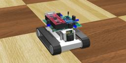

The Surveyor's SRV-1 is a robot with two caterpillar tracks designed for research, education, and exploration.
It features a Blackfin processor, a digital video camera and WiFi networking.

### SurveyorSrv1 PROTO

Derived from [Robot](https://cyberbotics.com/doc/reference/robot).

```
SurveyorSrv1 {
  SFVec3f    translation     0 0 0
  SFRotation rotation        0 0 1 0
  SFString   name            "SurveyorSrv1"
  SFString   controller      "surveyor"
  MFString   controllerArgs  []
  SFString   customData      ""
  SFBool     supervisor      FALSE
  SFBool     synchronization TRUE
  MFNode     extensionSlot   []
}
```

#### SurveyorSrv1 Field Summary

- `extensionSlot`: Extends the robot with new nodes in the extension slot.

### Samples

You will find the following sample in this folder: "[WEBOTS\_HOME/projects/robots/surveyor/worlds]({{ url.github_tree }}/projects/robots/surveyor/worlds)".

#### [srv-1.wbt]({{ url.github_tree }}/projects/robots/surveyor/worlds/srv-1.wbt)

 This simulation shows a Surveyor robot which moves in a square arena while avoiding obstacles.
