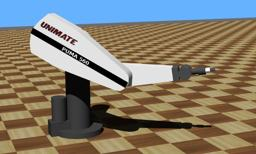

The [PUMA robotic arm](https://en.wikipedia.org/wiki/Programmable_Universal_Machine_for_Assembly#Model_560_C) (for "Programmable Universal Machine for Assembly") is a six axes arm with three axes making up a spherical wrist.

### Movie Presentation


### Puma560 PROTO

Derived from [Robot](https://cyberbotics.com/doc/reference/robot).

```
Puma560 {
  SFVec3f    translation     0 0 0
  SFRotation rotation        0 0 1 0
  SFString   name            "PUMA 560"
  SFString   controller      "puma560"
  MFString   controllerArgs  []
  SFString   customData      ""
  SFBool     supervisor      FALSE
  SFBool     synchronization TRUE
  MFNode     bodySlot        []
  MFNode     gripperSlot     []
}
```

#### Puma560 Field Summary

- `bodySlot`: Extends the robot with new nodes in the body slot.

- `gripperSlot`: Extends the robot with new nodes in the gripper slot.

### Samples

You will find the following sample in this folder: "[WEBOTS\_HOME/projects/robots/unimation/puma/worlds]({{ url.github_tree }}/projects/robots/unimation/puma/worlds)".

#### [puma560.wbt]({{ url.github_tree }}/projects/robots/unimation/puma/worlds/puma560.wbt)

 This simulation shows the PUMA robot which moves to different targets.
