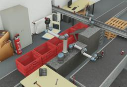

The Universal Robots [UR3e](https://www.universal-robots.com/products/ur3-robot/), [UR5e](https://www.universal-robots.com/products/ur5-robot/) and [UR10e](https://www.universal-robots.com/products/ur10-robot/) are flexible collaborative robot arms with 6 degrees of freedom.

These robot models and controllers are sponsored by the [ROSin european project](http://rosin-project.eu/ftp/cross-platform-ros-simulation-for-mobile-manipulators).

### Movie Presentation


### UR3e, UR5e and UR10e PROTO

Derived from [Robot](https://cyberbotics.com/doc/reference/robot).

```
UR5e/UR5e/UR10e {
  SFVec3f    translation     0 0 0
  SFRotation rotation        0 0 1 0
  SFString   name            "UR5e"
  SFString   controller      "<generic>"
  MFString   controllerArgs  []
  SFBool     supervisor      FALSE
  SFBool     synchronization TRUE
  SFBool     selfCollision   TRUE
  MFNode     toolSlot        []
  SFBool     staticBase      TRUE
}
```

#### Field Summary

- `toolSlot`: Extend the robot with new nodes at the end of the arm.

- `staticBase`: Defines if the robot base should be pinned to the static environment.

### Samples

You will find the following sample in this folder: "[WEBOTS\_HOME/projects/robots/universal\_robots/worlds]({{ url.github_tree }}/projects/robots/universal_robots/worlds)".

#### [ure.wbt]({{ url.github_tree }}/projects/robots/universal_robots/worlds/ure.wbt)

 This simulation shows an UR3e, an UR5e and an UR10e robot, equipped with a [ROBOTIQ 3F Gripper](https://webots.cloud/run?url=https://github.com/cyberbotics/webots/blob/released/projects/devices/robotiq/protos/Robotiq3fGripper.proto), grabbing cans on conveyor belts and putting them in crates.
